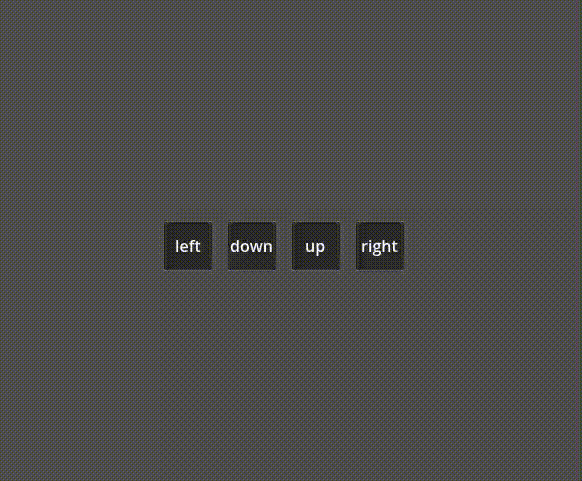
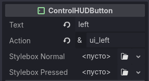

# ControlHUD
## What is this?
ControlHUD is a Godot Engine add-on that adds an object that shows control action presses graphically.

## Usage (to be improved)
1. Open a scene to add a ControlHUD in.
2. Instantiate it *(Ctrl + Shift + A)*
3. Set it up (configure shown text and action name)

    
    
    **text** - text that will be shown on the button in-game
    
    **action** - action that will make a ControlHUD change its stylebox to **stylebox_pressed** when pressed

    **stylebox_normal** - stylebox that will be shown when the **action** isn't pressed

    **stylebox_pressed** - stylebox that will be shown when the **action** is pressed

## License
See `LICENSE` for info.